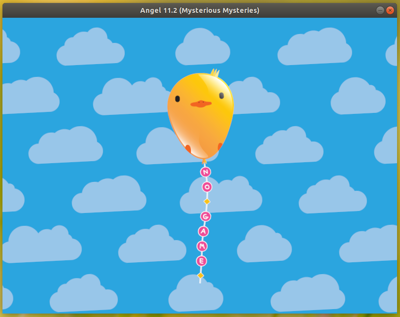

# Angel
This is [LÖVE](https://love2d.org/), but with [AngelScript](http://angelcode.com/angelscript/) bindings instead of Lua.

## Why?
For fun, really. I adore LÖVE, but I don't enjoy using Lua too much myself. Some of the benefits of Angel are:

- A type-safe language
- An object oriented language
- No need to `require()` your scripts (all files are "bundled" together)

## Roadmap
Eventually I plan to get everything from LÖVE 11.2 to bind to AngelScript, so that you can actually make games with it. Here's a few milestones:

- [x] Basic API coverage by getting the "no game" screen to run
- [ ] Running games from a specific directory
- [ ] Game configuration (eg. `love.conf`)
- [ ] .angel file generation
- [ ] Embedding game in binary
- [ ] All modules have base registrations
- [ ] Complete 11.2 API coverage

## Screenshot
This screenshot shows the "no game" screen ported to AngelScript. The source for this can be found in [the game directory](/game).

